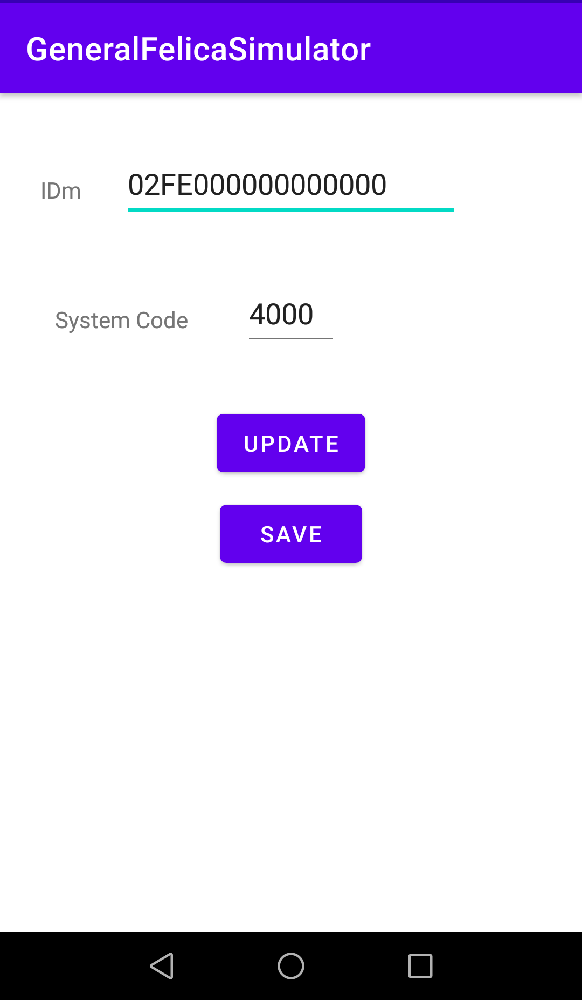

# GeneralFelicaSimulator

Generally simulate IDm and System code as FeliCa.

# Can I Execute This App?

Use [HCEFChecker][3] to determine whether the device has emulation feature.

# Restrictions

Without HCE-F unlocking, only these parameters can be set.
(where X is 0 to F)

IDm: `2FEXXXXXXXXXXX`

System Code: `4XXX` (except `4XFF`s)

rf. HCE-F Guideline Chapter 2.4

[Host-based Card Emulation for NFC-F Application Development Guidelines (Sony)][5]

[(Japanese Ver) Host-based Card Emulation for NFC-F アプリケーション開発ガイドライン][7]

# How to Unlock HCE-F

If rooted, the Xposed Module [HCEFUnlocker][10] could unlock the restrictions.

# LICENSE

This software includes the work that is distributed under the Apache License 2.0.

[3]: https://github.com/OLIET2357/HCEFChecker/releases
[5]: https://www.sony.net/Products/felica/business/tech-support/data/M1053_Host-Based_Card_Emulation_for_NFC-F_Guideline_1.02e.pdf
[7]: https://www.sony.co.jp/Products/felica/business/tech-support/data/M1053_hce_f_app_design_guideline_1.02j.pdf
[10]: https://github.com/OLIET2357/HCEFUnlocker/releases
